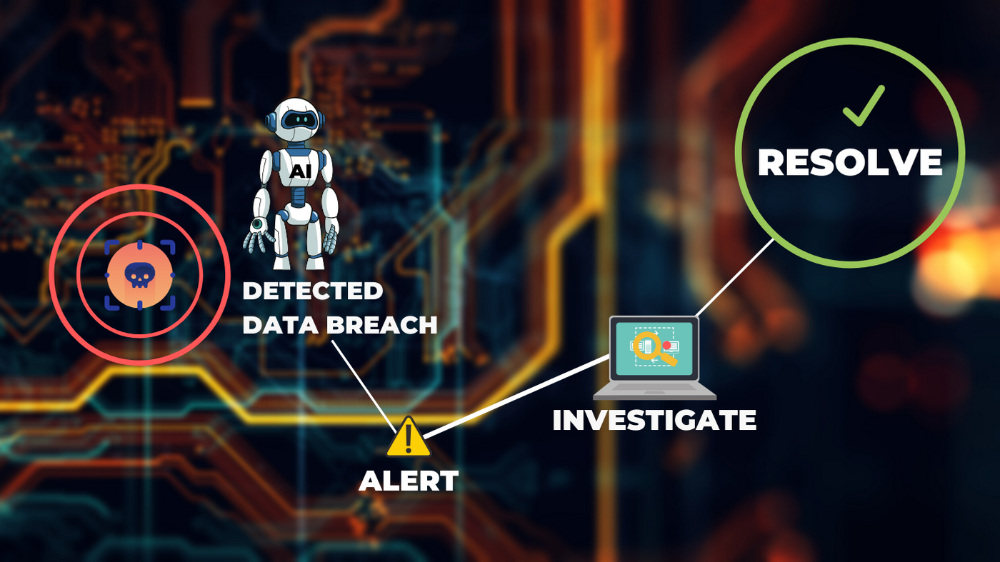

# Data Science Portfolio

---

## Machine learning

### Fraud Detection

##### Fraud detection is a set of processes and analyses that allow businesses to identify and prevent unauthorised financial activity. This may include fraudulent credit card transactions, identity theft, cyber hacking, insurance scams and more. #####

### We Help in ###

1. Real-time Screening
2. Deep Insights into User Behavior
3. Accurate Detection

#### Price

| Basic        | Student           | Premium  |
| ------------- |:-------------:| -----:|
| $100      | $500  | $1600 |

######  *Developed By Suchin chouta* ###### 
 
